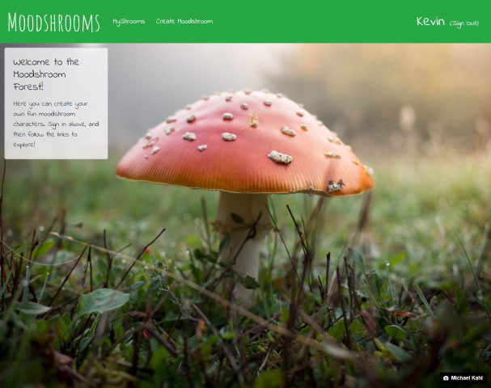
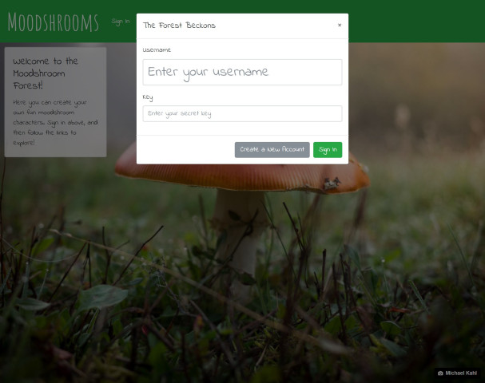
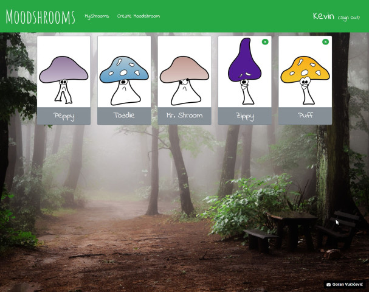
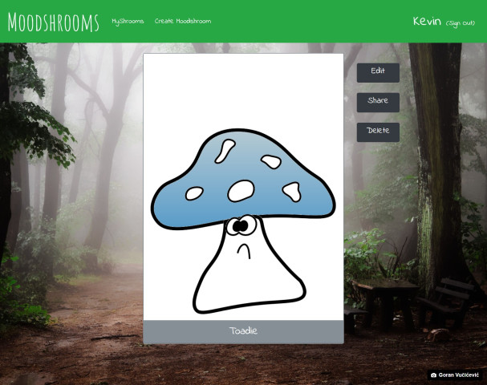
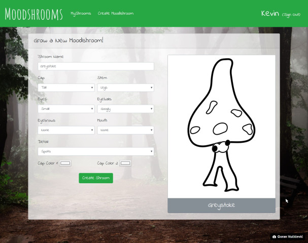

# Moodshrooms (Client)
> A fun website where you can create cartoon mushroom characters called 'Moodshrooms'.
> This is the frontend client.

The Moodshrooms client uses the Bootstrap framework, along with standard HTML5, CSS3, and a bit
of jQuery. Axios is used for sending requests to the server.

* Offers a responsive design with bright colors and fun characters.
* Parts for moodshrooms can be dynamically chosen, and any combination of two colors can be
    chosen for the cap.
* Offers very primitive user authentication (I refer to the user secret as a 'key' rather than 
    a 'password' intentionally to call attention to this.) Please don't reuse passwords you
    care about when playing with this site.

## Screenshots

## Installation
1. npm install
### Development
2. npm run dev

## Next Steps
- [ ] Add ability to delete users.
- [ ] Possibly add robust security (though there's nothing sensitive about this app).